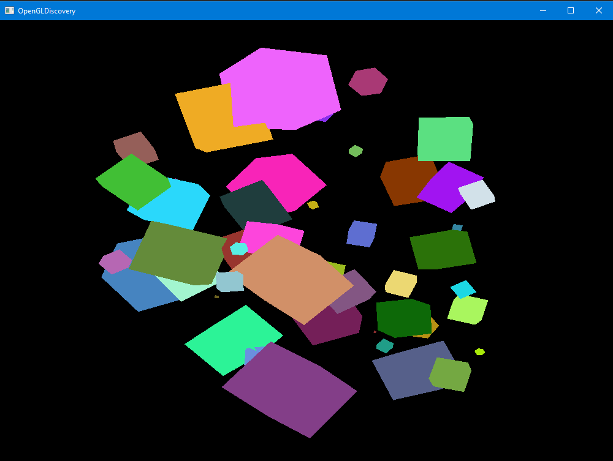
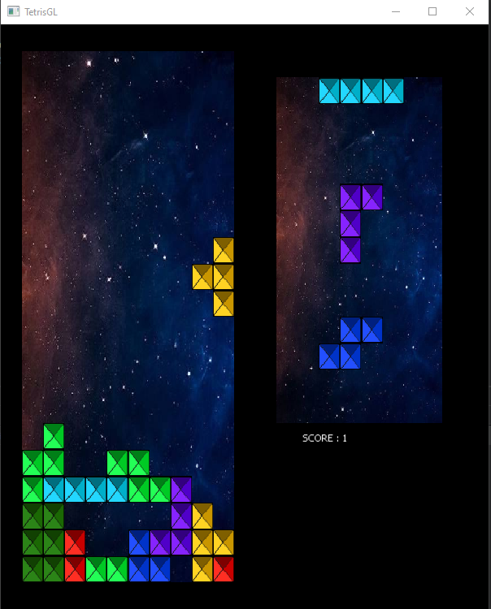

# OpenGLDiscovery
Discovering modern OpenGL with two projects, that use Qt to handle user interfaces.

A simple scene with randomly generated colored cubes, and a rotating camera that responds to keyboard.

A Tetris game, replicating classical gameplay.

